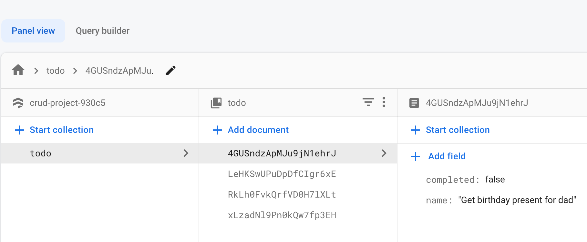
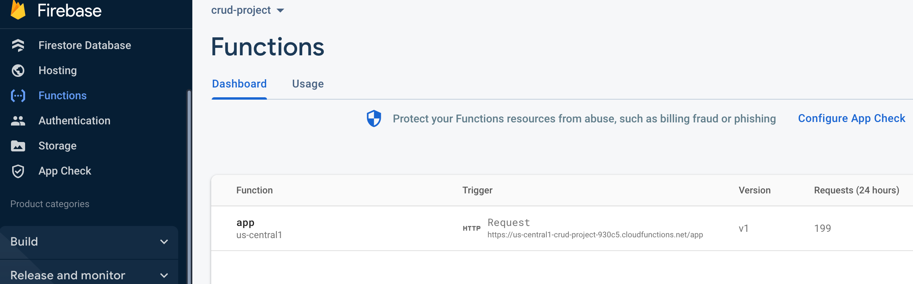
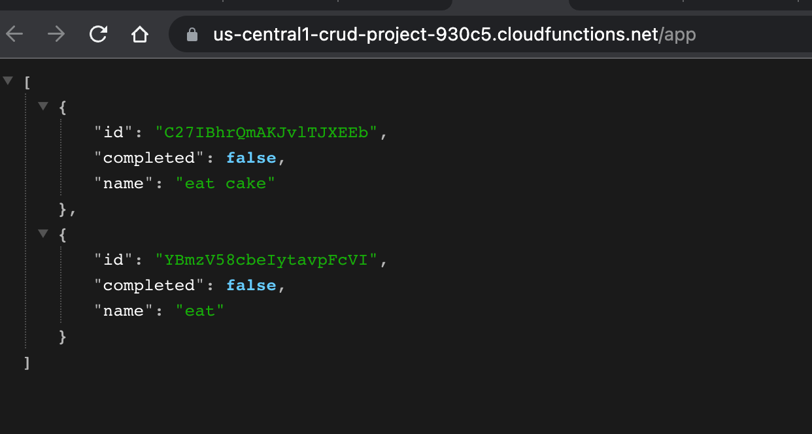
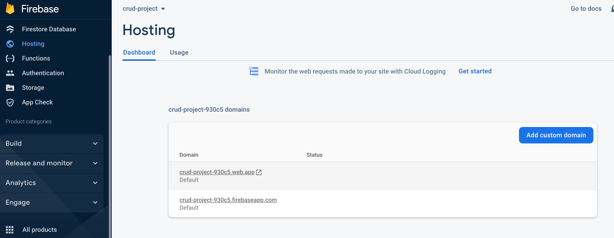

# To-do list app (REST API)

I made a to-do list where a user can add, delete and edit a task.

The files you want to look at:
Server => functions/ index.js  
Frontend => src/ App.js

Live site: https://crud-project-930c5.web.app/

For this project I wanted to try Firebase, essentially working with a FERN stack. Firebase is quite similar to MongoDB in the sense that it offers NoSQL database hosting. Firebase is basically a suite where you can use multiple tools to develop a fullstack application. Making a database (called Firestore) is one of them and that is what I used to make my database. What drew me to Firebase is the option to also host your server and website. Instead of the server being hosted locally it is hosted in the Firebase cloud - which makes the data accessible everywhere :crystal_ball:. 

When you visit the live site, you should be able to see some tasks that I have already added as they are stored in the NoSQL database. Anyone with a link to the site can add/delete/edit. So feel free to delete the tasks, and add some new ones. 

# Firebase - database and hosting :fire:
I would highly recommend Firebase if you are making your own backend and want to host your server, and then deploy the website. It's kind of an all in one type of package, which is very convenient. If you are only looking to make a database, you could frankly just as well use MongoDB. I wasn't sure how complicated the hosting was going to be so I made that last - which I don't recommend! If you know you want to host and use all the cool Firebase features then I would start off by installing the Firebase CLI and essentially make a Firebase app, it will save you a lot of backtracking and poking through the documentation later. Do look at the documentation though, if you are interested in using it, I found it very detailed and very helpful (most of the time).

## Here you can see my database on Firestore:

## My server in the Firebase cloud :cloud_with_snow::

## Server in the wild:

## My deployed website in Firebase:

